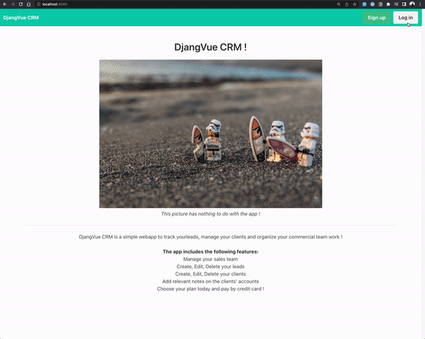

The site is live: you can check it [here](https://djangvue-crm.netlify.app/)!

# A simple CRM built with Django and Vue

.

## Features:

The app includes the following features:

- Authenticate the user,
- Create members and assign them to my team,
- Create, Edit, Delete, Search your leads,
- Create, Edit, Delete, Search your clients,
- Transform a lead into a client,
- Add notes on the clients' accounts,
- Admin can handle the plans,
- Stripe payment implemented

## Stack

- Built with django and django restframework for the backend
- Built with Vue.js, and bulma (CSS framework) for the frontend
- Powered by sqlite3 for the dev.
- Powered with stripe for the payment method.
- env variables dealt with python-environ

## How to make it run locally

- Django server : `py manage.py runserver`, once virtual env is sourced
- Vue server: `npm run serve`
- Stripe: once Stripe CLI installed, and logged in, run : `./stripe listen --forward-to localhost:{DjangoLocalHOSTPORT}/stripe_webhooks`

_Based on a tutorial of [Code with Stein](https://www.youtube.com/playlist?list=PLpyspNLjzwBl-u7Vh8mGfqqRKcVxHzqlp)_
